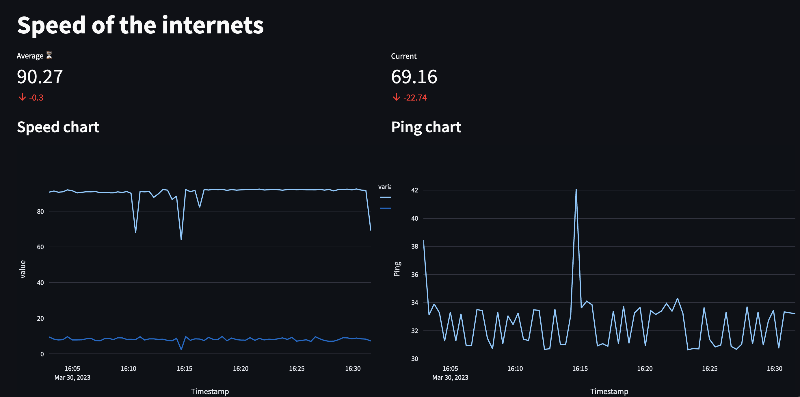

# speedtest_dashboard
Internet speed continuous monitoring with streamlit dashboard.

[](https://travis-ci.org/joemccann/dillinger) [](https://www.python.org/downloads/release/python-360/)

## Table of Contents
1. [Usage](#usage)
2. [Files](#files)
3. [Logging](#logging)



## Usage <a name="usage"></a>

To install the package requirements that are needed, run the following (ideally inside a venv):
```lang-bash
>>> pip install -r requirements.txt 
```
Then, to run the dashboard:
```lang-bash
>>> streamlit run app.py 
```
which initiates the web-app at `http://localhost:8501` (`127.0.0.1:8501`) in the browser.
The app can be stopepd with Ctrl-C, as it will continue indefinitely as well as store all data in a local SQL database.

## Files <a name="files"></a>
- `app.py`
	- API top level runner - streamlit definitions.
- `db.py`
	- Database interaction.
- `getter.py`
	- Runs the `sppedtes-cli` subprocess and gathers all relevant data.
- `speedtest.py`
	- Standalone speedtest Python port without dashboard.
- `logger.py`
	- Does logger stuff (logger definition and config).

# Logging <a name="logging"></a>
| Level      | When it is used |
| ----------- | ----------- |
| DEBUG      | Detailed information, typically of interest only when diagnosing problems.|
| INFO      | Confirmation that things are working as expected.|
| WARNING      | An indication that something unexpected happened, or indicative of some problem in the near future (e.g. ‘disk space low’). The software is still working as expected.|
| ERROR   | Due to a more serious problem, the software has not been able to perform some function.|
| CRITICAL      | A serious error, indicating that the program itself may be unable to continue running.|

